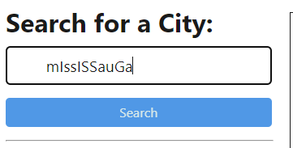

# Weather Dashboard

## Description

The Weather Dashboard is a web application designed to provide users with weather information for various cities. It leverages the OpenWeather API to retrieve and display both current and future weather conditions. The project was developed to enhance skills in integrating third-party APIs and deploying full-stack applications. This dashboard solves the problem of quickly accessing weather data for trip planning or other needs. Throughout this project, I learned how to connect a front-end application with a back-end service and deploy it using Render.

## Table of Contents

- [Installation](#installation)
- [Usage](#usage)
- [Credits](#credits)
- [License](#license)
- [Badges](#badges)
- [Features](#features)
- [How to Contribute](#how-to-contribute)
- [Tests](#tests)

## Installation

To set up the development environment for this project, follow these steps:

1. Clone the repository to your local machine.
2. Install the necessary dependencies by running `npm install` in the project directory.
3. Run the application locally using `npm run start`.

## Usage

To use the Weather Dashboard:

1. Enter a city name into the search field.
2. The application will display the current weather and a 5-day forecast for the city.
3. The search history is saved locally, and clicking on a past search will reload the weather data for that city.
4. You can also delete a city from the search history if needed.

## Credits

Made by AdminChatter GitHub: https://github.com/adminchatter

If you have any questions, please contact me at xiangzhenwu.dev@gmail.com

## License

This project is licensed under the [MIT](https://opensource.org/licenses/MIT) license. 
Click the license above to learn more about this license.

## Badges

## Features

- Real-time weather data retrieval.
- 5-day weather forecast for any city.
- Persistent search history with options to delete entries.
- Formatting user's input for city's name

## How to Contribute

Contributions are welcome! Please fork the repository and create a pull request with your changes. Ensure your code follows the best practices for naming conventions, indentation, and includes descriptive commit messages.

## Tests

To run tests for the application:

1. Use the command `npm test`.
2. Ensure all features are functioning as expected before committing your changes.
